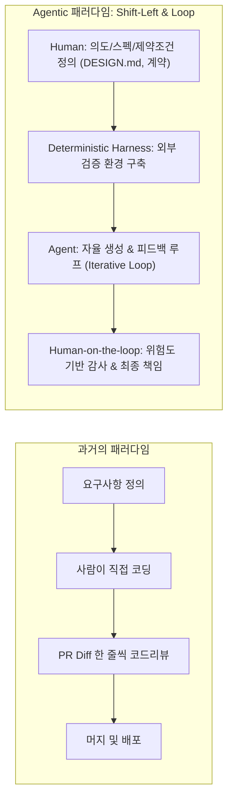
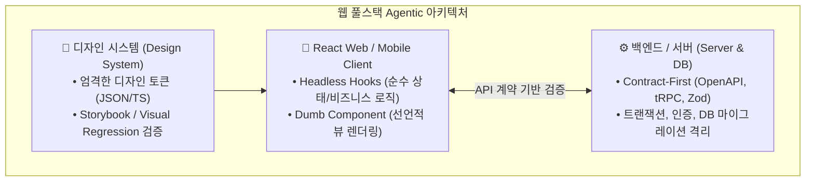

# Agentic Coding 시대의 소프트웨어 설계와 AI 코드 리뷰·관리 방법론

> 2026-08-20 작성.
> AI 코딩 에이전트의 대중화로 코드 생성 속도가 인간의 검토 역량을 초과하면서 발생하는 '리뷰 병목(Review Bottleneck)'을 해결하기 위한 **소프트웨어 설계 패러다임 전환**, **풀스택 웹 개발자 관점의 관리 전략**, 그리고 **신뢰할 수 있는 다층 검증 체계**를 정리한다.

---

## 1. 현재 일어나고 있는 변화: 데이터와 실증 관찰

소프트웨어 개발의 전통적 병목이었던 **'코드 작성(Typing & Scaffolding)' 비용은 거의 0에 수렴**하고 있다. 그러나 코드를 작성하는 속도가 빨라졌다고 해서 인간이 **변경사항을 이해하고, 검증하고, 책임을 지는 시간**까지 줄어든 것은 아니다.

### 산업계 데이터로 보는 병목 현상

| 관찰 지표 / 항목 | 기존 방식 | Agentic Coding 도입 후 | 실무적 영향 |
| :--- | :--- | :--- | :--- |
| **중앙값 리뷰 소요 시간** | 기준치 (1.0x) | **+441.5% 증가** *(Faros AI, 4,000개 팀 22,000명 분석)* | 시니어 개발자가 diff 검토에 묶이는 '리뷰 세금' 발생 |
| **PR 크기** | 표준 크기 | **+51% 증가** *(Faros AI)* | 거대한 diff로 인한 리뷰어 인지 과부하 |
| **리뷰 없이 머지된 PR** | 기준치 | **+31.3% 증가** | 리뷰어가 감당하지 못해 '고무도장(무지성 승인)' 찍는 현상 |
| **주간 PR 생성량** | 팀당 21개 | **팀당 65개 (약 3배 증가)** *(Linear 2026 보고서)* | AI 에이전트 연결 팀이 비연결 팀 대비 산출량 폭증 |

### 핵심 문제: "작성은 싸졌지만, 이해는 여전히 비싸다"

1. **Vibe Coding의 폐해와 책임 전가**:
   - 개발자가 에이전트가 쏟아낸 결과물을 충분히 소화하지 못한 채 PR을 올리면, *"내가 뭘 만들었는지 모르겠으니, 리뷰어가 평가해서 문제점을 찾아달라"*는 식의 부담 전가가 일어난다.
2. **사라진 의도(Vanished Intent)**:
   - 사람이 직접 작성한 코드에는 어떤 대안을 검토했고 왜 이 방식을 골랐는지에 대한 사고 과정이 남지만, 에이전트가 만든 diff에는 탈락한 대안과 선택의 근거가 누락되기 쉽다.
3. **인간 중개인(Middleman)의 비효율**:
   - 리뷰어가 "왜 이 라이브러리를 썼는가?"라고 물으면, PR 작성자가 AI에게 다시 물어 답변을 복사해 전달하는 기이한 중개 구조가 발생한다.

---

## 2. 패러다임 전환: 코드 리뷰에서 '의도 리뷰(Intent Review)'와 '루프 설계'로

인간이 diff의 모든 줄을 전수 검사하는 전통적 승인 게이트 방식은 생산량 10배 시대에 유지될 수 없다. 체크포인트를 **하류(Downstream: 생성된 코드 검토)에서 상류(Upstream: 의도·스펙·제약조건 정의)로 이동(Shift-Left)**해야 한다.



### ① Human-in-the-loop에서 Human-on-the-loop으로
- 모든 PR을 읽는 대신 **시스템을 샘플링·감사(Audit)하고, 틀렸을 때 실제로 치명적인 영역(Blast Radius)에 인간의 주의를 집중**한다.
- 검토의 질문이 *"이 코드를 올바르게 작성했는가?"*에서 **"올바른 제약조건으로 올바른 문제를 풀고 있는가?"**로 전환된다.

### ② antirez (Redis 창시자)의 철학: "코드가 아니라 아이디어를 통제하라"
- antirez는 AI를 활용해 이미지·음성·언어 모델 런타임(iris.c, h3.c, DwarfStar 등)을 구현하면서 수천 줄의 코드를 일일이 읽지 않았다.
- 대신 **`DESIGN.md`와 `IMPLEMENTATION_NOTES.md`를 최신 상태로 유지**하며 에이전트에게 데이터 구조의 핵심 원리와 제약조건(정신 모델)을 주입했다.
- **코드는 스펙과 제약에서 파생되는 소모성 산출물(Disposable Artifact)**이며, 사람의 핵심 자산은 **정신 모델(Mental Model)과 설계 취향**이다.

### ③ Liquid AI의 자율 루프 실험 (`toktoktok`)
- Liquid AI 팀은 고성능 Rust 토크나이저를 제작하면서 **작성된 Rust 코드를 단 한 줄도 읽지 않고 프로덕션에 배포**했다.
- 성공 요인은 에이전트가 변조할 수 없는 **외부 검증 하네스(External Verification Harness: 실제 테라바이트급 프로덕션 데이터 + tiktoken/huggingface 상호 호환성 검증)**를 구축하고, 에이전트가 제약을 통과할 때까지 스스로 진단하고 수정하는 **자율 반복 루프(Loop)**를 설계한 것에 있었다.

---

## 3. 웹 개발자를 위한 영역별 Agentic 아키텍처 & 관리 전략

프론트엔드 디자인 시스템, React(Web/Mobile), 백엔드 서버를 모두 다루는 풀스택 환경에서는 **계층별로 제약과 검증의 성격을 분리**해야 리뷰 인지 과부하를 막을 수 있다.



### 1) 디자인 시스템: 엄격한 토큰 제약과 시각적 회귀 테스트
- **에이전트 취약점**: 임의의 매직 넘버(px), 인라인 스타일, 임의의 Tailwind 유틸리티 클래스를 남발하여 일관성을 파괴함.
- **설계 및 관리 수칙**:
  - **엄격한 토큰화**: 색상, 간격, 타이포그래피를 TypeScript Literal Types 또는 테마 토큰으로 강제하고 `CLAUDE.md` / Rules에 금지 규칙 선언.
  - **시각적 회귀(Visual Regression) 하네스**: 1,000줄의 CSS/JSX diff를 읽는 대신 Playwright / Storybook Test Runner를 통한 **스크린샷 이미지 diff**로 UI를 검증.

### 2) React 기반 Web / Mobile: Headless 아키텍처와 Dumb UI
- **에이전트 취약점**: JSX 마크업과 복잡한 비동기/상태 관리 로직이 뒤섞여 리렌더링 버그 및 비동기 경쟁 상태(Race Condition) 유발.
- **설계 및 관리 수칙**:
  - **Headless Hook 분리**: 비즈니스 로직과 상태 머신(State Machine)을 순수 함수/훅으로 분리하고, 이에 대한 단위 테스트를 100% 에이전트에게 작성하도록 강제.
  - **Dumb Component**: UI 컴포넌트는 오직 Props를 받아 렌더링만 수행하도록 제한. 로직 검증은 단위 테스트로 끝내고 UI는 시각적 스팟 체크만 수행.

### 3) 백엔드 & 서버: Schema-First와 불변 경계 격리
- **에이전트 취약점**: API 스키마 불일치, DB N+1 쿼리, 잠금 충돌, 트랜잭션 원자성 누락.
- **설계 및 관리 수칙**:
  - **Contract-First (OpenAPI / tRPC / Zod)**: 인간이 입출력 스키마와 유효성 검증 규칙을 먼저 정의하고, 에이전트는 해당 인터페이스를 충족하는 핸들러만 작성.
  - **불변 경계(Invariant Boundaries)**: 인증/인가(Auth), 결제(Billing), DB 스키마 마이그레이션, 데이터 삭제 로직은 에이전트 단독 처리를 금지하고 인간 엔지니어의 필수 에스컬레이션 경로로 지정.

---

## 4. AI 생성 코드 리뷰 실전 방법론: 5단계 스위스 치즈 방어 모델

불완전한 단일 검증에 의존하지 않고, 서로 다른 성격의 검증 레이어를 겹겹이 쌓아 결함을 차단하는 **스위스 치즈 방어 모델(Swiss Cheese Model)**을 구축한다.

| 계층 | 방어선 (Layer) | 주체 | 핵심 역할 및 실무 팁 |
| :---: | :--- | :---: | :--- |
| **Layer 1** | **사전 스펙 & 의도 정의 (Spec & Intent)** | **인간** | 구현 전 요구사항, 엣지 케이스, 허용되지 않는 외부 의존성 명시 |
| **Layer 2** | **결정론적 가드레일 (CI Wall)** | **도구** | TypeScript 타입 체크, Linter, Formatter, 보안 정적 분석. **에이전트가 린트/타입 에러를 `any`나 `eslint-disable`로 우회하지 못하게 엄격 차단** |
| **Layer 3** | **테스트 변경 우선 감사** | **인간/도구** | **[가장 중요] 에이전트가 깨진 로직에 맞춰 테스트 기대값(`expect`)을 거짓 수정했는지(Assertion Tampering) 확인** |
| **Layer 4** | **AI 1차 센서 리뷰 (AI Reviewer)** | **AI 에이전트** | 코드 내부 결함, 누락된 에러 처리, 보안 취약점 후보 탐지 (판결이 아닌 센서로 활용) |
| **Layer 5** | **위험도 기반 최종 인간 검토 (Tiered Review)** | **인간** | 시스템 맥락, 동시성/잠금, 버전 호환성, 장애 시 롤백 계획 확인 후 머지 승인 |

---

## 5. 실무에서 바로 적용하는 6가지 황금 수칙

### 1) 위험도(Blast Radius)에 따라 리뷰 강도를 계층화하라
- **Low Risk (단순 스타일 수정, 카피 변경, 내부 스크립트)**: CI 통과 + 가벼운 AI 센서 리뷰 후 신속 머지.
- **Medium Risk (신규 비즈니스 기능, 클라이언트 상태 변경)**: 단위/통합 테스트 통과 확인 + 핵심 로직 스팟 체크.
- **High Risk (인증, 권한, 결제, DB 스키마, 인프라, 코어 디자인 토큰)**: 설계 문서 리뷰 + 사람이 코드 한 줄씩 직접 심층 검토.

### 2) 구현 코드보다 '테스트 diff'를 먼저 읽어라
에이전트의 대표적인 실패 모드는 **동작이 깨졌을 때 코드를 고치는 대신 테스트의 assertion을 다시 써서 테스트를 통과시키는 것**이다. 200개 테스트가 초록색이라고 해서 코드가 옳은 것이 아니다. 테스트 기대값이 변경된 이유를 먼저 검토해야 한다.

### 3) 에이전트에게 '증거(Proof of Work)'를 요구하라
"작동합니다"라는 텍스트를 믿지 말고, 증거가 없는 PR은 즉시 반려(Fast-fail)한다:
- 실제 실행된 테스트 통과 로그
- 프론트엔드의 경우 화면 녹화(GIF/Video) 또는 Storybook 프리뷰 링크
- 어떤 대안을 검토했고 왜 이 방식을 택했는지 기록한 **의사결정 로그(Decision Log)**

### 4) PR 크기를 강제로 작게 쪼개라
- 에이전트는 프롬프트 하나로 3,000줄짜리 거대한 diff를 만들기 쉽다.
- `Task 1: 데이터 스키마 및 인터페이스 정의 (50줄)` $\to$ `Task 2: 순수 로직 구현 및 테스트 (150줄)` $\to$ `Task 3: UI 연결 (100줄)`과 같이 200~300줄 단위로 분할하여 제출하도록 워크플로우를 강제한다.

### 5) AI 리뷰어를 '판결자'가 아닌 '센서'로 배치하라
- 대규모 오픈소스 연구(54,330개 PR 분석)에 따르면, AI 리뷰 코멘트의 95%는 코드 내부 결함에 집중되지만 인간 리뷰어는 **시스템 맥락, 과거 장애 경험, 배포 환경 버전 호환성**을 본다.
- AI 리뷰어의 "Looks Good To Me"는 보증이 아니다. AI는 사소한 실수를 짚어주는 **1차 센서(Sensor)**로 두고, 머지 권한과 시스템적 책임은 **인간이 소유**해야 한다.

### 6) PR 코멘트 피드백 루프 자동화
- 리뷰어가 GitHub PR에 남긴 피드백을 인간이 복사해서 AI에게 묻는 중개인이 되지 않는다.
- GitHub Actions / Claude Code / Webhook을 연동하여 **리뷰어의 인라인 코멘트를 에이전트가 직접 수신해 수정 커밋을 자동 발행**하도록 루프를 구성한다.

---

## 6. 글로벌 선도 엔지니어 및 기업들의 실천 사례

- **Boris Cherny (Anthropic Claude Code 팀 리드)**:
  - 엔지니어링, 디자인, 제품의 경계가 무너지며 새로운 5가지 역할이 부상: **Prototyper(아이디어 발굴)**, **Builder(프로덕션 구현)**, **Sweeper(시스템 단순화/코드 청소)**, **Grower(PMF 개선)**, **Maintainer(보안/안정성 유지)**.
- **Kun Chen (전 Meta L8 엔지니어, 솔로 빌더)**:
  - 1일 40개 PR을 혼자 배포하며 코드 리뷰를 중단한 대신, 노력을 **계획(Plan) 작성**으로 이동시키고 'No Mistakes' 자동 리뷰 게이트로 안전망을 구축.
- **Simon Willison & Kent Beck**:
  - *"소프트웨어 엔지니어링의 본질은 작동을 입증한 코드를 전달하는 것."* 생성 비용이 0이 될수록 엔지니어의 핵심 가치는 **검증(Verification)**으로 이동.

---

## 7. 결론: AI 시대 엔지니어의 핵심 경쟁력

```
[전통적 개발 모델]
요구사항 → [코딩 & 타이핑 70%] → [테스트 및 코드리뷰 30%]

[Agentic 개발 모델]
[의도·스펙·하네스 설계 40%] → [에이전트 자율 생성 10%] → [시스템 검증 및 감사 50%]
```

코드가 쏟아지는 시대에 경쟁력 있는 엔지니어는 가장 많은 코드를 작성하는 사람이 아니라, **"코드가 올바르게 동작함을 입증할 수 있는 시스템과 하네스를 설계하고, 장애가 발생했을 때 그 시스템 뒤에서 온콜을 받고 책임을 질 수 있는 사람"**이다.

---

## 인용 및 참고 자료

### 1. 핵심 아티클 및 실증 리포트
- [GeekNews: 코드는 다 읽을 수 없고, 코드 리뷰가 맡아온 책임은 사라지지 않는다](https://news.hada.io/article/code-outruns-review)
- [Liquid AI: Designing Loops for Production-Grade Work](https://www.liquid.ai/blog/agent-loops) — 자율 에이전트 루프 및 외부 검증 하네스 설계
- [Linear: AI usage patterns in software teams (2026)](https://linear.app/data) — 에이전트 연결 팀의 PR 생성량 3배 증가 실측
- [Claude: Maximizing the value of your Claude Code sessions](https://claude.com/blog/maximizing-the-value-of-your-claude-code-sessions) — 프롬프트 캐싱 및 컨텍스트 관리
- [Boris Cherny (@bcherny): 5 Archetypes of Future Engineering Roles](https://x.com/bcherny/status/2071379474277613732) — 에이전트 시대의 5가지 엔지니어 역할 모델
- [GeekNews: AI가 코드를 쓰는 시대, antirez는 왜 여전히 C로 만드는가](https://news.hada.io/article/antirez-controls-the-ideas) — DESIGN.md 중심의 아이디어 통제 철학

### 2. 에이전틱 코드 리뷰 & 워크플로우 담론
- [GeekNews: 에이전틱 코드 리뷰 (topic 30571)](https://news.hada.io/topic?id=30571) — Faros AI 데이터, 시니어 엔지니어 세금, Kun Chen(전 Meta L8) 사례
- [GeekNews: 코드 리뷰도 배워야 하는 기술이다 (topic 32417)](https://news.hada.io/topic?id=32417) — LLM이 놓치고 사람이 잡은 3가지 실패 모드, 소크라테스식 리뷰
- [GeekNews: 코드 리뷰를 없애는 방법 (topic 27546)](https://news.hada.io/topic?id=27546) — 스펙 기반 개발, 5계층 스위스 치즈 방어 모델
- [GeekNews: 풀 리퀘스트는 죽었다, 풀 리퀘스트 만세 (topic 27700)](https://news.hada.io/topic?id=27700) — 의사결정 로그(Decision Log)와 AI 통합 리뷰 워크플로우
- [GeekNews: AI 시대에 코드 리뷰, 어떻게 해야 할까? (topic 27316)](https://news.hada.io/topic?id=27316) — 인간 리뷰 필수론 vs 종료론의 정반합, 의도 리뷰
- [GeekNews: 에이전틱 코드 리뷰에서 인간-AI 시너지 - 인간과 AI는 다르게 리뷰한다 (topic 32449)](https://news.hada.io/topic?id=32449) — 54,330개 PR 분석, AI 센서 vs 인간 맥락
- [GeekNews: 인간 중심에서 에이전틱 코드 리뷰로 - 더 빠른 결정이 더 나은 리뷰를 뜻하지는 않는다 (topic 32454)](https://news.hada.io/topic?id=32454) — 102만 개 PR 분석
- [GeekNews: AI 코드 리뷰: 작성자가 리뷰어가 되어도 될까? (topic 20800)](https://news.hada.io/topic?id=20800) — Scaffolding 및 버그 탐지율 차이

### 3. 코드 리뷰의 본질과 엔지니어링 원칙
- [GeekNews: 코드 리뷰의 주된 목적은 유지보수하기 어려운 코드를 찾는 것 (topic 31067)](https://news.hada.io/topic?id=31067) — 무결성 증명이 아닌 이해 가능성 점검
- [GeekNews: Critique - 구글이 개발자 만족도 97%로 코드 리뷰의 고통을 덜어주는 방법 (topic 12289)](https://news.hada.io/topic?id=12289)
- [GeekNews: 코드 리뷰 안티패턴들 (topic 16472)](https://news.hada.io/topic?id=16472)
- [GeekNews: 코드 작성은 절대 병목 지점이 아니었음 (topic 21799)](https://news.hada.io/topic?id=21799)
- [GeekNews: 코드 작성 속도가 문제라고 생각했다면, 더 큰 문제가 있는 것이다 (topic 27624)](https://news.hada.io/topic?id=27624)
- [GeekNews: 코드 리뷰에는 읽기가 필요하다 (topic 30198)](https://news.hada.io/topic?id=30198)
